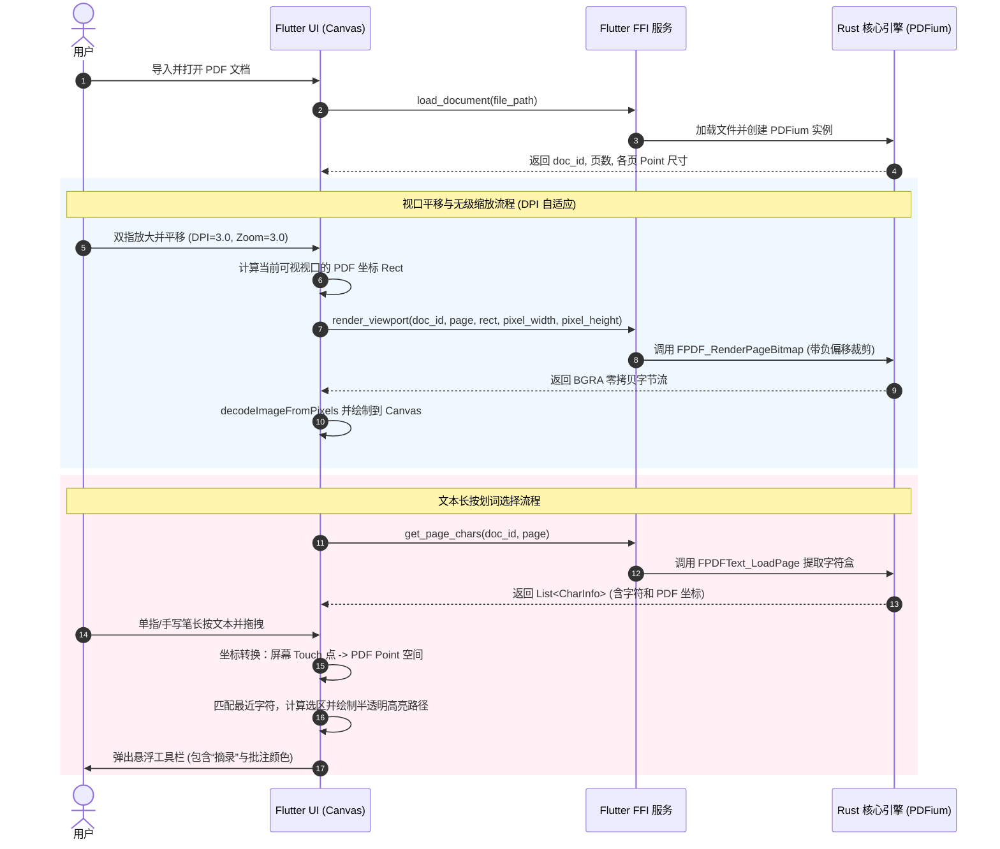

# Starmind Phase 2 PRD: PDF 矢量视口渲染器与文本划词选择引擎

## 1. 文档概述

### 1.1 背景
Starmind 作为跨平台（Windows + Android 平板）的高性能知识管理软件，其最核心的基石是 **PDF 阅读体验**。在旧版 Saber 中，PDF 的渲染由于依赖整页图片或第三方原生 Platform View 渲染，导致在平板放大时文本模糊，且 PDF 页面手势与手写笔迹图层手势高度冲突。
为了提供像素级清晰的无级缩放，并保证手势的 100% 可控，本项目采用 Rust FFI (`pdfium-render`) 动态计算视口瓦片位图并提取字符坐标，由 Flutter Canvas 统一完成绘制和手势捕获。

### 1.2 目标
*   **矢量清晰度**：在 100% 到 1000% 缩放区间内，任何视口瓦片都必须以当前物理 DPI 精确渲染，文字边缘绝无锯齿与模糊。
*   **低延迟交互**：视口平移和缩放时的重绘延迟在流畅感知阈值内（重绘帧率不低于 45fps，单瓦片渲染延迟 < 60ms）。
*   **精确划词**：支持像素级的文本选择，长按并拖拽能够高亮字符，并精准获取选中文本。
*   **独立撤销**：在单次 PDF 阅读会话内，支持对高亮、下划线等批注进行 Undo/Redo。

---

## 2. 核心用户流程与业务场景



---

## 3. 功能性需求与技术实现细化

### 3.1 坐标空间转换数学公式 (Coordinate Mapping)
PDF 文件使用“用户空间”（User Space）坐标系，屏幕显示使用“逻辑像素空间”与“物理像素空间”。我们在 Flutter 中必须进行精确转换：

*   **PDF 用户空间**：原点 $(0,0)$ 在页面**左下角**，Y轴向上，单位为 PDF Point ($1/72$ 英寸)。页面尺寸记为 $(W_{pdf}, H_{pdf})$。
*   **Flutter 画布空间（逻辑像素）**：原点 $(0,0)$ 在页面**左上角**，Y轴向下。

#### 公式 1：PDF 用户空间点 $(X_{pdf}, Y_{pdf})$ 映射为 Flutter 缩放比例为 1.0 时的画布点 $(X_{canvas}, Y_{canvas})$：
$$X_{canvas} = X_{pdf}$$
$$Y_{canvas} = H_{pdf} - Y_{pdf}$$

#### 公式 2：在缩放倍率为 $Zoom$ 时，映射为缩放画布上的点 $(X_{canvas\_zoomed}, Y_{canvas\_zoomed})$：
$$X_{canvas\_zoomed} = X_{pdf} \times Zoom$$
$$Y_{canvas\_zoomed} = (H_{pdf} - Y_{pdf}) \times Zoom$$

#### 公式 3：用户触摸屏幕点 $(X_{touch}, Y_{touch})$，在考虑视口平移滚动偏移 $ScrollX, ScrollY$ 以及缩放 $Zoom$ 的情况下，转换回 PDF 用户空间点 $(X_{pdf}, Y_{pdf})$：
首先转换为缩放画布上相对于页面左上角的点：
$$X_{canvas\_zoomed} = X_{touch} + ScrollX$$
$$Y_{canvas\_zoomed} = Y_{touch} + ScrollY$$
再换算为 PDF Point 空间：
$$X_{pdf} = X_{canvas\_zoomed} / Zoom$$
$$Y_{pdf} = H_{pdf} - (Y_{canvas\_zoomed} / Zoom)$$

### 3.2 Rust FFI 接口协议 (API Schema)

```rust
// 1. 初始化 PDFium 动态链接库
pub fn init_pdfium(library_path: Option<String>) -> Result<(), String>;

// 2. 加载文档，返回映射 UUID 字符串
pub fn load_document(file_path: String) -> Result<String, String>;

// 3. 关闭文档，释放内存
pub fn close_document(doc_id: String) -> Result<(), String>;

// 4. 获取文档页数
pub fn get_page_count(doc_id: String) -> Result<u32, String>;

// 5. 获取指定页面的物理尺寸 (PDF Points: width, height)
pub fn get_page_size(doc_id: String, page_index: u32) -> Result<(f32, f32), String>;

// 6. 视口瓦片渲染请求结构体
pub struct ViewportRequest {
    pub doc_id: String,
    pub page_index: u32,
    pub pdf_left: f32,       // 可视区域 PDF 左边界
    pub pdf_top: f32,        // 可视区域 PDF 上边界 (PDF 坐标系下，通常大于 bottom)
    pub pdf_right: f32,      // 可视区域 PDF 右边界
    pub pdf_bottom: f32,     // 可视区域 PDF 下边界
    pub target_width: u32,   // 渲染目标物理像素宽 (已乘以 DPR)
    pub target_height: u32,  // 渲染目标物理像素高 (已乘以 DPR)
}

// 7. 渲染视口瓦片，返回 BGRA 格式的原始字节流
pub fn render_viewport(req: ViewportRequest) -> Result<Vec<u8>, String>;

// 8. 字符包围盒信息结构体
pub struct CharInfo {
    pub text: String,
    pub index: u32,
    pub left: f32,
    pub top: f32,
    pub right: f32,
    pub bottom: f32,
}

// 9. 获取页面所有字符及其坐标列表
pub fn get_page_chars(doc_id: String, page_index: u32) -> Result<Vec<CharInfo>, String>;
```

### 3.3 Flutter 视口动态瓦片渲染算法 (Tiled Renderer)
为避免在 500% 缩放时渲染整页导致内存崩溃（6000x8000 像素的 RGBA 占用约 192MB），重绘机制必须按视口裁剪：
1.  Flutter 的滚动组件（如 `SingleChildScrollView` 或自定义平移画布）监听当前可视区域的 Bounds。
2.  通过公式 3 将可视边界的四个角转换为 PDF Point 空间的可视坐标 $(Left_{pdf}, Top_{pdf}, Right_{pdf}, Bottom_{pdf})$。
3.  计算目标渲染分辨率（如可视宽 800px $\times$ 设备 DPR 2.0 = 1600 物理像素宽）。
4.  Flutter 发起异步 FFI 请求，Rust 仅在内存中为 1600x1200 像素大小分配 `FPDF_BITMAP`。
5.  在 Rust 侧，使用以下负偏移量调用 `FPDF_RenderPageBitmap`：
    *   计算缩放比例：$ScaleX = Width_{pixel} / (Right_{pdf} - Left_{pdf})$
    *   计算整页在当前缩放下的总像素尺寸：$ScaledWidth = PageWidth \times ScaleX$
    *   计算偏移量：$StartX = - (Left_{pdf} \times ScaleX)$, $StartY = - ((PageHeight - Top_{pdf}) \times ScaleY)$
    *   PDFium 就会把以 $(Left_{pdf}, Top_{pdf})$ 为起点的局部页面精准绘制到当前 1600x1200 的 bitmap 中。
6.  Rust 通过 FFI 返回 `Vec<u8>` 指针，Flutter 通过 `ui.decodeImageFromPixels` 无拷贝生成 `ui.Image` 并绘制，确保极速和超低内存。

### 3.4 划词手势与高亮生成逻辑
1.  **加载数据**：打开页面时，异步加载 `get_page_chars`，保存在本地内存列表中。
2.  **长按激活**：当检测到单指长按（LongPressStart）时，将屏幕坐标转为 PDF 坐标，并在字符列表中查找与之碰撞（相交）的字符，记录为选区起点字符 `start_char`。
3.  **滑动选词**：在 LongPressUpdate 中，持续转换当前触摸点坐标，匹配最近的字符，标记为终点字符 `end_char`。
4.  **选区高亮计算**：
    *   提取 `[start_char.index, end_char.index]` 区间内的所有字符。
    *   将相邻且同行的字符包围盒（Rect）合并为一个大的高亮区域（Highlight Region）。
    *   使用 Flutter `CustomPainter` 在 PDF 位图图层上方绘制带 $30\%$ 透明度的预设高亮颜色背景。
5.  **工具栏弹出**：在 LongPressEnd 时，获取当前选区最后一个字符的物理屏幕位置，在其正上方 20 逻辑像素处弹出浮动工具栏（包含“高亮颜色选择”、“下划线”、“波浪线”和“摘录”按钮）。

### 3.5 单次会话撤销栈 (Session Undo/Redo)
*   **状态模型**：在 Flutter 侧为每个打开的文档维护一个 `UndoRedoStack`。
*   **记录动作（Action）**：定义 `AddHighlightAction`、`DeleteHighlightAction`、`AddUnderlineAction` 等结构，记录动作前后的批注状态及 ID。
*   **操作回滚**：当点击撤销按钮时，弹出栈顶 Action 并调用其 `undo()`，即在前端删除/恢复对应的绘制高亮框，并同步通知 Rust 引擎，重绘受影响的可视瓦片。

---

## 4. 非功能性需求与性能指标 (NFR)

*   **渲染时间**：单瓦片在 FFI 中的纯 Rust 渲染时间小于 40ms，Flutter 侧解析与首帧绘制小于 20ms，总响应时间 $< 60ms$。
*   **防抖重绘**：在连续拖拽/滑动 PDF 时，视口渲染请求需进行防抖处理（建议防抖阈值为 80-120ms），防止由于高频重画导致 FFI 管道堵塞。在滑动中可渲染低分辨率占位图，静止后重画高清图。
*   **线程隔离**：所有 FFI 渲染任务必须在 Rust 的后台工作线程中执行，严禁阻塞 Flutter 的 UI 主线程。
*   **内存控制**：单页 PDF 渲染时，除当前可视瓦片及相邻预加载瓦片外，应及时释放不可见瓦片的 `ui.Image` 缓存，内存增加不得超过 50MB。

---

## 5. 异常处理与边缘情况

1.  **非文字型 PDF (扫描版/图片PDF)**：
    *   *异常现象*：`get_page_chars` 返回的列表为空，用户长按无法选中任何文字。
    *   *处理机制*：长按时检测到无字符相交，自动退化为“区域选框/截图模式”，允许用户拉出一个矩形框进行截图摘录。
2.  **动态库丢失**：
    *   *异常现象*：在没有安装 PDFium 运行时或 DLL/SO 文件丢失的机器上。
    *   *处理机制*：Starmind 启动时进行 init_pdfium 校验，若失败，跳转到专门的引导页面提示“PDF 引擎初始化失败，请检查运行依赖”。
3.  **PDF 文档损坏**：
    *   *异常现象*：用户导入了损坏的、无法解析的或加密的 PDF。
    *   *处理机制*：`load_document` 返回 `Err(String)`，Flutter 侧捕获异常，用友好的 Dialog 提示“无法打开此文档，可能已损坏或有密码保护”。
