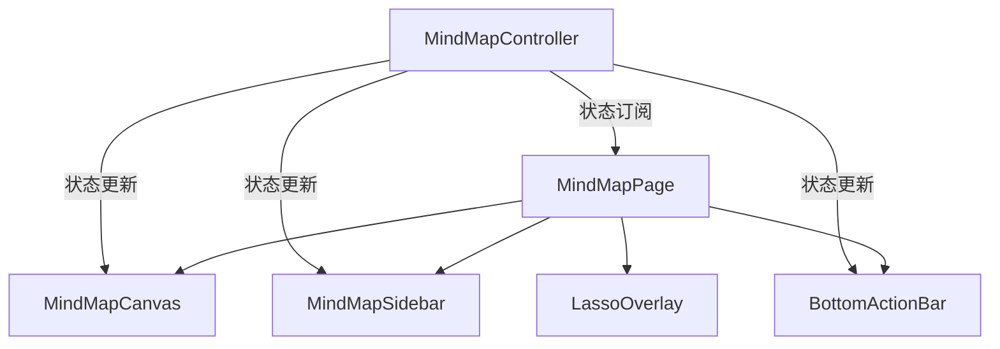

# Spec: 思维导图高保真复刻设计规范与技术文档 (v10.0)

本规范详细定义了如何将 `D:\starmind\prototype\思维导图页面\index.html` 中的高保真设计细节完美复刻到 Flutter 项目中的技术实现方案。

---

## 1. 系统架构与模块解耦设计

本设计严格采用**方案 B（模块解耦与控制器编排架构）**，将整个思维导图页面拆分为核心画布、右侧固定分栏侧边栏、底部悬浮操作栏以及套索选择层。



---

## 2. 状态模型与控制器扩展 (`MindMapController`)

在 `lib/src/mindmap/ui/mindmap_controller.dart` 中新增以下状态和控制机制，以实现全方位的响应式数据管理。

### 2.1 状态枚举定义
```dart
/// 侧边栏垂直 Tab 类型
enum SidebarTab { note, style, icon }

/// 鼠标/手势交互模式
enum CanvasInteractMode { drag, lasso }
```

### 2.2 扩展控制器字段
```dart
class MindMapController extends ChangeNotifier {
  // ===== 垂直侧边栏状态 =====
  bool _isSidebarExpanded = false;
  SidebarTab _activeSidebarTab = SidebarTab.note;

  bool get isSidebarExpanded => _isSidebarExpanded;
  SidebarTab get activeSidebarTab => _activeSidebarTab;

  void toggleSidebar(SidebarTab tab) {
    if (_isSidebarExpanded && _activeSidebarTab == tab) {
      _isSidebarExpanded = false;
    } else {
      _isSidebarExpanded = true;
      _activeSidebarTab = tab;
    }
    notifyListeners();
  }

  // ===== 主题风格自定义 (持久化存储于 Topic.thumbnailPath JSON 中) =====
  Color _canvasBgColor = const Color(0xFF0C0A07);
  Color _gridColor = const Color(0x05FAD278);
  bool _showGrid = true;
  double _gridSize = 40.0;

  Color get canvasBgColor => _canvasBgColor;
  Color get gridColor => _gridColor;
  bool get showGrid => _showGrid;
  double get gridSize => _gridSize;

  // 设置并保存主题状态
  Future<void> updateTheme({
    Color? canvasBgColor,
    Color? gridColor,
    bool? showGrid,
    double? gridSize,
  }) async {
    if (canvasBgColor != null) _canvasBgColor = canvasBgColor;
    if (gridColor != null) _gridColor = gridColor;
    if (showGrid != null) _showGrid = showGrid;
    if (gridSize != null) _gridSize = gridSize;
    
    notifyListeners();
    await _saveThemeToDatabase();
  }

  // ===== 套索多选与锁定编辑状态 =====
  CanvasInteractMode _interactMode = CanvasInteractMode.drag;
  bool _isLocked = false;
  final Set<String> _selectedNoteIds = {};

  CanvasInteractMode get interactMode => _interactMode;
  bool get isLocked => _isLocked;
  Set<String> get selectedNoteIds => _selectedNoteIds;

  void setInteractMode(CanvasInteractMode mode) {
    _interactMode = mode;
    if (mode == CanvasInteractMode.drag) {
      _selectedNoteIds.clear();
    }
    notifyListeners();
  }

  void toggleLock() {
    _isLocked = !_isLocked;
    notifyListeners();
  }

  void setSelectedNotes(Set<String> noteIds) {
    _selectedNoteIds.clear();
    _selectedNoteIds.addAll(noteIds);
    notifyListeners();
  }
}
```

---

## 3. 右侧高保真侧边栏与兄弟节点导航

### 3.1 视口弹性分栏布局 (Fluid Tri-Panel Row)
在 `MindMapPage` 的 `build` 树中将画布、侧边栏内容以及垂直固定 Tab 栏放置在 `Row` 容器中。画布的 `Expanded` 会在侧栏展开时自动分配收缩空间，完美避让遮挡。

### 3.2 垂直 Tab 圆角蓝色激活态 (Space-Dark & Glowing Blue)
*   **非激活状态**：背景透明，图标前景色为中度半透明白色（`0x8CFFFFFF`），鼠标悬停时过渡为亮白色。
*   **激活状态**：背景更新为圆角深蓝色（`#1862C6`），图标颜色为纯白，带有微光向外发散的发光暗影，呈现强烈的纵深发光质感。

### 3.3 Sibling Navigator 兄弟节点循环跳转算法
在笔记面板头部提供 `<` 和 `>` 按钮，并在 `MindMapController` 中实现快速循环选择：
```dart
void navigateSibling(String direction) {
  final activeNode = selectedNote;
  if (activeNode == null || activeNode.parentId == null) return;

  // 1. 获取兄弟节点列表
  final siblings = getNoteSiblings(activeNode.id);
  if (siblings.length <= 1) return;

  // 2. 计算当前索引与下一个目标索引
  final currentIndex = siblings.indexWhere((n) => n.id == activeNode.id);
  if (currentIndex == -1) return;

  int targetIndex;
  if (direction == 'prev') {
    targetIndex = (currentIndex - 1 + siblings.length) % siblings.length;
  } else {
    targetIndex = (currentIndex + 1) % siblings.length;
  }

  // 3. 执行选择切换，更新状态并通知 UI
  selectNote(siblings[targetIndex]);
}
```

---

## 4. 两行式 Markdown 编辑栏与主题配置面板

### 4.1 Markdown 高级快捷工具栏 (光标感知定位算法)
两行快捷键按钮布局如下：
*   **第一行**：`H`（标题）、`B`（粗体）、`I`（斜体）、`S`（删除线）、`链接` | `无序列表`、`有序列表`、`任务列表` | `引用`（纸飞机图标）、`分割线`（横线）。
*   **第二行**：`代码块`（`</>`）、`行内代码`（`< >`） | `云上传`、`表格` | `撤销`、`重做`。

### 4.2 零 Rust 迁移的主题持久化机制 (Zero-Migration Theme Storage)
为规避复杂的 Rust FFI SQLite 数据模型结构迁移，画布配置风格将直接转化为标准的 JSON 格式：
```json
{
  "theme": {
    "canvasBg": "#0c0a07",
    "gridColor": "rgba(250,210,120,0.05)",
    "gridShow": true,
    "gridSize": 40.0
  }
}
```
*   **读写机制**：
    *   该 JSON 字符串直接覆写到 `mindmap_topics` 表的 `thumbnail_path` 字段中。
    *   初始化导图笔记本加载时，若检测到 `thumbnailPath` 字段的字符串以 `{"theme"` 开头，自动拦截解析为导图背景配置并通知 CustomPaint 进行网格渲染，完美达成零数据库迁移的平滑升级。

### 4.3 自定义取色盘 (HSL & Color Presets)
样式面板中配置 4 个预设色块及 1 个渐变彩虹色调色盘按钮，支持分别修改 **画布背景** 与 **网格细线颜色**，在取色器颜色变化时实时触发 `controller.updateTheme()` 刷新画布。

---

## 5. 套索多选手势引擎与底部悬浮工具栏

### 5.1 底部悬浮操作栏 (Frosted-Glass Bottom ActionBar)
使用 `BackdropFilter(filter: ImageFilter.blur(sigmaX: 10, sigmaY: 10))` 渲染高透半透明面板，悬浮于画布底部中央。包含：
*   缩放微调按钮组（`-`、显示当前 `(scale * 100).toInt()%` 比例文本、`+`）。
*   拖动/套索模式切换双态按钮。
*   布局快速选择下拉框（弹出在按钮正上方 2px 处）。
*   编辑锁定（🔒 开关）。

### 5.2 套索多选手势与逆矩阵相交碰撞检测
当 `interactMode == CanvasInteractMode.lasso` 时，屏蔽 InteractiveViewer 的手势响应，并在背景放置 `GestureDetector` 手势捕获层。

1.  **套索范围绘制**：滑动手指在屏幕上拉出虚线选择框 $Rect_{scr}$。
2.  **绝对坐标逆矩阵变换**：
    将屏幕触摸框的起点与终点投射回考虑了 `InteractiveViewer` 位移与缩放后的 Canvas 绝对物理空间中：
    ```dart
    final matrix = transformationController.value;
    final scale = matrix.getMaxScaleOnAxis();
    final tx = matrix.entry(0, 3);
    final ty = matrix.entry(1, 3);

    // 屏幕框选矩形转为画布实际物理矩形
    final canvasLeft = (selectionRect.left - tx) / scale;
    final canvasTop = (selectionRect.top - ty) / scale;
    final canvasRight = (selectionRect.right - tx) / scale;
    final canvasBottom = (selectionRect.bottom - ty) / scale;
    
    final canvasSelectionRect = Rect.fromLTRB(canvasLeft, canvasTop, canvasRight, canvasBottom);
    ```
3.  **相交碰撞匹配**：
    遍历当前脑图所有节点的绝对边界框：
    ```dart
    final selectedIds = <String>{};
    for (final entry in positions.entries) {
      final noteId = entry.key;
      final pos = entry.value;
      final size = layout.nodeSizes[noteId] ?? Size(layout.nodeWidth, layout.nodeHeight);
      
      final nodeBounds = Rect.fromLTWH(
        pos.dx - size.width / 2, 
        pos.dy, 
        size.width, 
        size.height
      );
      
      if (canvasSelectionRect.overlaps(nodeBounds)) {
        selectedIds.add(noteId);
      }
    }
    controller.setSelectedNotes(selectedIds);
    ```

---

## 6. 验证与单元测试规划

### 6.1 单元测试 (Automated Testing)
在 `test/mindmap/ui/` 目录下新增对应的主题设置与套索计算单元测试：
*   **主题解析测试**：验证 JSON 格式主题与 `thumbnailPath` 的互转和降级逻辑。
*   **套索碰撞测试**：模拟坐标矩阵，输入一个屏幕选框坐标，验证碰撞计算是否精准挑中预期范围内的节点 ID 集合。
*   **批量删除测试**：验证 `deleteSelectedNotes` 批量数据库事务提交和树模型重构。

### 6.2 手动集成校验
*   打开思维导图笔记本，分别点击 HSL 画布背景 and 网格线配置，确认背景和线型秒级渲染变化。
*   开启套索多选，在背景划出一道框，确认框内所有节点边框都闪烁起金色流光。一键点击删除，确认批量擦除无误。
