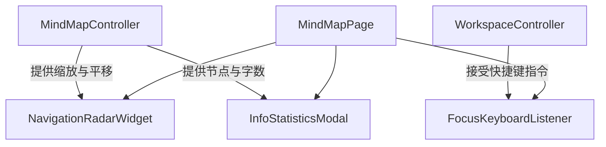

# Spec: 脑图双向交互雷达、信息弹窗与全局快捷键联动设计规范 (v10.1)

本规范详细定义了如何在 Flutter 端实现思维导图 Phase 4 的高级特性，涵盖双向交互小地图、高精度统计弹窗、Workspace 全局快捷键联动以及防闪退分屏方案。

---

## 1. 系统架构与交互设计

本设计作为 v10.0 重构版本的后续延续，依然遵循**方案 B（组件解耦与控制器编排）**。在画布层级上方叠加两个高质感磨砂玻璃浮层：导航雷达浮窗与信息统计弹窗，并通过 Focus 树监听键盘映射联动宿主控制器。

---

## 2. 悬浮双向交互导航雷达 (Navigation Minimap)

### 2.1 物理几何指标与缩放投影
*   小地图浮窗尺寸设定：宽 $W_{radar} = 200\text{px}$，高 $H_{radar} = 150\text{px}$。
*   雷达自适应几何比例计算 $S_{radar}$（基于画布上所有节点的绝对包围框 $Rect_{bounds}$）：
    $$S_{radar} = \min\left(\frac{W_{radar} - 16}{W_{bounds}}, \frac{H_{radar} - 16}{H_{bounds}}\right)$$
*   **元素投射公式**：
    *   **微缩节点边界**：
        $$Left_{node\_radar} = (pos.dx - size.width/2 - Bounds.left) \times S_{radar} + 8$$
        $$Top_{node\_radar} = (pos.dy - Bounds.top) \times S_{radar} + 8$$
    *   **可视视口框 (Viewport Box)**：
        $$Left_{view\_radar} = (visibleRect.left - Bounds.left) \times S_{radar} + 8$$
        $$Top_{view\_radar} = (visibleRect.top - Bounds.top) \times S_{radar} + 8$$
        在雷达浮层上绘制为金黄色边框（`#C8841A`），带 $10\%$ 透明度的矩形选框。

### 2.2 双向手势拖拽导航
1.  **大图滚动更新雷达**：画布平移时触发页面 `setState`，重绘 `RadarPainter` 顺滑更新可视选框位置。
2.  **雷达平移画布**：小地图可视框上覆盖 `GestureDetector`，拖拽位移 $(\Delta X_{radar}, \Delta Y_{radar})$ 逆换算回画布平移量 $(\Delta X_{canvas}, \Delta Y_{canvas})$：
    $$\Delta X_{canvas} = \frac{\Delta X_{radar}}{S_{radar}}$$
    $$\Delta Y_{canvas} = \frac{\Delta Y_{radar}}{S_{radar}}$$
    更新 `_transformationController.value` 使画布平滑跳转定位。

---

## 3. 高保真磨砂信息统计弹窗 (Info Statistics Modal)

点击底部栏左侧 `Icons.info_outline_rounded` 图标，在屏幕中央弹出统计弹窗：
*   **视觉规范**：宽 `280px`，高 `320px`，磨砂背景 `0xD91C222B` 附加模糊滤镜 `ImageFilter.blur(sigmaX: 12, sigmaY: 12)`，带 `1px` 微白微透边框。
*   **计算指标**：
    *   **节点总数**：递归求和 `NoteTreeNode.totalNodes`。
    *   **总字数统计**：递归提取所有节点的标题字数之和以及笔记 plainText 字符数之和。
    *   **嵌套卡片容器数**：遍历 `highlightStyle == 'nestedCard'` 节点数。
    *   **脑图最大深度**：递归计算树层级最大深度。
    *   **关联 PDF**：读取 `Topic.pdfIds.length`。

---

## 4. 全局快捷键监听映射与防崩溃联动 (Shortcuts)

### 4.1 全局快捷键物理绑定映射
在 `MindMapPage` 外层 `Focus` 组件中捕获以下按键：
*   `Tab` -> 创建子节点 `controller.createChildNode()`
*   `Enter` -> 创建同级节点 `controller.createSiblingNode()`
*   `Delete/Backspace` -> 批量删除选中节点 `controller.deleteSelectedNotes()`
*   `Space` -> 折叠/展开选中分支 `controller.toggleNodeCollapse()`
*   `F2` -> 激活选中节点重命名弹窗 `_showRenameDialog()`
*   `Alt + Q` -> 锁定/解锁编辑画布 `controller.toggleLock()`
*   `Ctrl + Shift + E` -> 视口自适应全屏 `_fitToScreen()`
*   `Ctrl + Alt + [` -> 联动 `WorkspaceController.setSidebarOpen(...)` 开关主导航文件夹树
*   `Ctrl + Alt + ]` -> 联动 `controller.toggleSidebar(SidebarTab.note)` 开关右侧笔记栏
*   `Ctrl + Alt + \` -> 循环旋转切换两侧/单左/单右布局
*   `Ctrl + W` -> 联动 `WorkspaceController.closeTabById(...)` 关闭当前 Tab

### 4.2 避灾防崩溃设计 (Crash-Proof Split Mode)
鉴于宿主程序 `main.dart` 存在强制将 `rootLayoutNode` 转型为 `LeafNode` 的限制，按 **`Ctrl + Alt + S`** 将触发 **“脑图内局部防崩溃分屏模式”**：
1.  在 `MindMapPage` 内部引入 `bool _isLocalSplitMode = false;` 状态。
2.  开启后，Scaffold body 内部画布一分为二，左半屏幕渲染当前的脑图 Canvas，右半屏幕以分栏形式极速渲染关联的 PDF 矢量视口面板（局部分屏），**完全不触碰主控制器的 rootLayoutNode 类型**，100% 避免转型 Cast Runtime Exception 闪退。

---

## 5. 验证与单元测试

*   **雷达计算测试**：在 `test/mindmap/ui/radar_painter_test.dart` 中验证微缩边界框和可视视口比例在各种 scale/位移矩阵下的数学投影准确性。
*   **快捷键监听测试**：编写测试用例验证按键事件是否能够被准确捕获并调用宿主 `WorkspaceController` 的接口。
