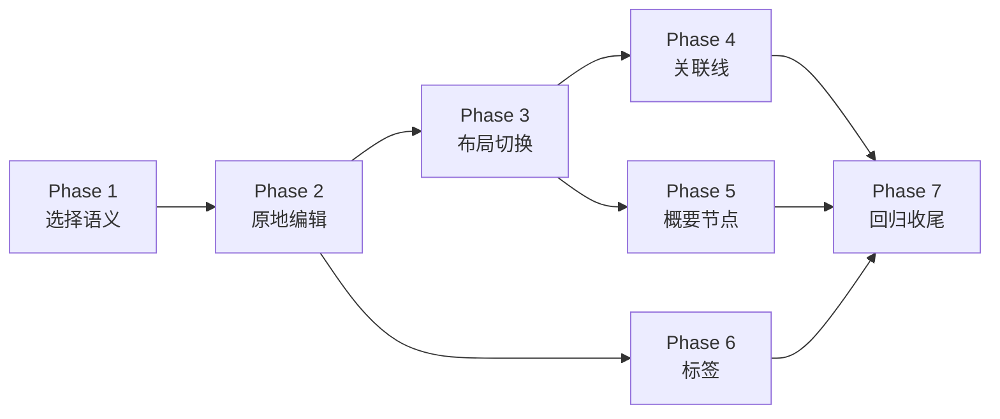

# 思维导图基础功能可用化开发蓝图（v15）

> 版本：1.0  
> 日期：2026-06-07  
> 范围：让思维导图的节点选择、原地编辑、布局切换、关联线、概要节点、标签等基础能力进入“可使用、可测试、可继续扩展”的状态。

## 设计原则

1. **以本项目为主**：优先沿用 `lib/src/mindmap` 已有的 `MindMapController`、`Note`、`MindMapService`、`TreeLayoutEngine`、`ConnectionRenderer` 等结构，不直接搬运外部项目实现。
2. **参考但不复制**：参考 `D:/package/hierarchy` 的层级布局与路径绘制思路，参考 `E:/app/wanglin-mindmap/simple-mind-map` 的 `AssociativeLine`、`MindMapLayoutPro`、`generalization`、`tag` 数据表达和交互流程。
3. **先交互闭环，再数据扩展**：优先修复“点击、编辑、添加、布局切换”这些影响日常使用的基础链路，再实现需要新增模型的关联线、概要和标签。
4. **数据模型可迁移**：新增关联线、概要、标签时，先在 Dart domain/repository/service 层定义清晰结构，再同步 FFI/Rust 存储，避免 UI 临时状态成为长期事实。
5. **布局与真实 Widget 一致**：涉及连线或概要位置时，必须同时验证逻辑 Rect 与真实 Widget Rect；左侧/右侧、短标题/长标题节点都要覆盖。
6. **导图布局属于导图级设置**：布局方向与框架式布局状态归属 Topic 或 Topic settings，不以单个 `Note.layoutStyle` 作为当前 UI 判断来源；`Note.layoutStyle` 仅保留为历史数据或导入兼容入口。

## 当前基线

- 交互入口：`lib/src/mindmap/ui/mindmap_page.dart` 负责画布、快捷键、节点渲染与底部工具栏回调。
- 状态入口：`lib/src/mindmap/ui/mindmap_controller.dart` 已有选中节点、框选、拖动模式、创建子节点/同级节点、布局方向、连线样式等状态。
- 节点 UI：`lib/src/mindmap/ui/node_widget.dart` 已支持选中态和框架式节点外观，但还没有原地文本编辑态。
- 布局引擎：`lib/src/mindmap/layout/tree_layout_engine.dart` 支持 `bothSides`、`rightOnly`、`leftOnly`、`fishbone`，但 UI 的 `LayoutDirection.left` 当前未正确映射到 `leftOnly`，框架式布局还没有成为导图级布局菜单的稳定选项。
- 弹窗位置参考：`prototype/思维导图页面/index.html` 的布局菜单在底部布局按钮正上方，宽约 100px，居中对齐，距离按钮约 2-8px。
- 渲染基础：`lib/src/mindmap/rendering` 已有普通父子连线渲染器，可作为关联线和概要连线的绘制基础。

## 阶段索引

| 阶段 | 目标 | Spec |
| --- | --- | --- |
| Phase 1 | 拖动模式下点击可选择节点，并建立稳定选择语义 | [phase-1-selection-and-inline-editing.md](specs/phase-1-selection-and-inline-editing.md) |
| Phase 2 | 原地编辑节点，添加子节点/同级节点后直接进入原地编辑 | [phase-2-inline-node-creation.md](specs/phase-2-inline-node-creation.md) |
| Phase 3 | 修复布局切换，恢复框架式布局入口，修正布局菜单位置 | [phase-3-layout-switching.md](specs/phase-3-layout-switching.md) |
| Phase 4 | 实现跨节点关联线的数据、交互和渲染闭环 | [phase-4-associative-lines.md](specs/phase-4-associative-lines.md) |
| Phase 5 | 实现概要节点的数据、选择范围和布局渲染 | [phase-5-summary-nodes.md](specs/phase-5-summary-nodes.md) |
| Phase 6 | 实现节点标签的数据、编辑入口和节点内展示 | [phase-6-node-tags.md](specs/phase-6-node-tags.md) |
| Phase 7 | 整体可用性收尾：快捷键、导入导出、回归测试与文档 | [phase-7-polish-and-regression.md](specs/phase-7-polish-and-regression.md) |

## 推荐执行顺序

## 验收总标准

1. 拖动模式下，单击节点只选择节点，不触发画布拖动副作用；双击节点进入原地编辑。
2. 添加子节点和同级节点不再弹出新增标题弹窗，新节点在画布原位置生成并直接进入编辑态。
3. 布局菜单选择两侧、左侧、右侧、框架式布局后，画布实际布局发生可见变化；菜单位置与原型图一致。
4. 关联线可从一个节点连接到另一个节点，可显示默认文字“关联”，可再次选中编辑或删除。
5. 概要节点可基于连续或多选节点创建，跟随布局变化，线条与节点边界贴合。
6. 标签可添加、展示、编辑、删除，并随节点持久化。
7. `flutter analyze` 无新增错误；相关 `test/mindmap` 单元测试和可覆盖的 widget 测试通过。

## 非目标

- 本轮不实现多人协作、远程同步、复杂主题市场或完整 XMind 兼容导出。
- 本轮不重写整个布局引擎；只在现有引擎上补齐菜单、策略映射和必要扩展点。
- 本轮不把外部项目代码直接复制进仓库。
