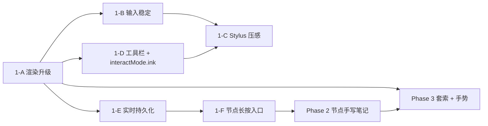

# v16 开发蓝图 — MarginNote 式手写思维导图

> 范围：在 v15 / v15.1 的思维导图基础上，叠加手写画布层、节点级手写笔记、手写转节点三大能力。**Phase 4（PDF 摘录联动）与 Phase 5（复习系统）移至 v17**，本版本只交付手写闭环。

## 1. 设计原则

1. **以本项目为主**：沿用 `lib/src/mindmap/ink/` 已有的 `InkLayer` / `InkStroke` / `InkLayerController` / `FfiInkLayerRepository` 与 `rust/src/storage/ink_layers.rs`，不重建 schema，不另起仓库。参考但不复制 `scribe_canvas` 的 `StrokeRendererUtil` 与 `fluera_canvas` 的 `StrokeStabilizer`。
2. **状态单一来源**：手写态以 `MindMapController.interactMode == CanvasInteractMode.ink` 为唯一判断，不引入并行的 `_isInkMode` 布尔。`InkTool` 工具状态可与 `interactMode` 正交。
3. **FFI 类型不外泄（RULES.md §1.5）**：所有 Rust 类型仅出现在 `FfiInkLayerRepository` 内部；`mindmap_page.dart` / controller / service 看到的只能是 Dart 侧 domain model。
4. **TDD 节奏**：每个 Plan 走「写失败测试 → 跑测试看到 FAIL → 写最小实现 → 跑测试看到 PASS → commit」标准红绿循环。
5. **forui 优先（RULES.md §1.8）**：详情面板、悬浮菜单、墨迹工具栏先查 <https://forui.dev/docs>，不覆盖才回落 Material/Cupertino。
6. **graphify 同步（RULES.md §1.7）**：每个 Plan 的 commit 步骤包含 `/graphify`，把 `graphify-out/` 一起入库；不更新就不允许合 PR。

## 2. 当前基线

| 子系统 | 现状 |
|---|---|
| `InkLayer` / `InkStroke` / `InkPoint` | 已有（`lib/src/mindmap/ink/ink_layer.dart`），含 `bounds`、`intersects`、`translate`、`addStroke`、`eraseIn`、`moveIn` |
| `InkLayerController` | 已有（`ink_layer_controller.dart`），支持 begin/append/end stroke、tool/color/width 切换，但没接稳定器、没接持久化 |
| `CanvasInkLayer` | 已有（`canvas_ink_layer.dart`），渲染用直线连接（粗糙）|
| `FfiInkLayerRepository` | 已完整实现，对接 Rust `mindmap_save_ink_layer` / `mindmap_get_ink_layer` |
| Rust 表 `ink_layers` | 已建（`db.rs:267`），列 `(id, type, owner_id, strokes_json, z_index, created_at, updated_at)`，`UNIQUE(owner_id, type)` |
| `CanvasInteractMode` | 已有 `drag`、`lasso`；本版本扩 `ink` |
| `Note` | 暂无 `inkLayerId` 字段，Phase 2 扩展 |
| `NodeWidget` | 已有选中态、原地编辑；无长按悬浮菜单、无墨迹缩略图 |

## 3. 阶段索引

| 阶段 | 目标 | Spec |
| --- | --- | --- |
| Phase 1 | 画布层手写：Catmull-Rom 渲染、输入稳定、Android Stylus 压感、`CanvasInteractMode.ink` 状态扩展、实时持久化、节点长按入口 | [phase-1-canvas-ink-layer.md](specs/phase-1-canvas-ink-layer.md) |
| Phase 2 | 节点内手写笔记：底部 `DraggableScrollableSheet` 详情面板、Markdown 编辑器、节点墨迹层、节点卡片缩略图（带缓存） | [phase-2-node-ink-notes.md](specs/phase-2-node-ink-notes.md) |
| Phase 3 | 手写转节点：套索批量选择墨迹，可选开关的 \$1 手势识别（圆/矩形 → 节点，箭头 → 连线，阈值 0.9） | [phase-3-ink-to-node.md](specs/phase-3-ink-to-node.md) |

## 4. 推荐执行顺序

Phase 3 不强依赖 Phase 2 的 Markdown / 详情面板，但依赖 Phase 1 的 ink 基础和 Phase 2 的 `Note.inkLayerId` 字段（用于「未来手势创建带墨迹的节点」）。本版本范围内 Phase 3 创建的节点不带初始墨迹，所以 Phase 3 在 Phase 1 完成后即可开始，并行 Phase 2。

## 5. 范围锁定 — 为什么 Phase 4 / 5 移到 v17

| 删的原因 | 详情 |
|---|---|
| Phase 1-3 已是一次完整的「能用」迭代 | 用户可以手写批注、节点写笔记、手势造图，独立成闭环 |
| Phase 4 PDF 摘录联动需要分屏改动 + 摘录栏新组件 | 与手写正交，单独成 v17 不阻塞 |
| Phase 5 FSRS 复习系统是另一个长期模块 | 需要 review 队列、统计面板、调度算法，体量大 |
| 减少一次性入库变更面 | 防止 v16 PR 过大、回归测试覆盖不全 |

## 6. 风险与已知坑

| 风险 | 来源 | 缓解 |
|---|---|---|
| `_isInkMode` 与 `interactMode` 双状态机出脏态 | 早期 spec 草稿 | Plan 1-D 已锁定单一状态源，禁止新增 `_isInkMode` |
| Plan 1-E 重建 `ink_layers` 表覆盖现有 Rust 代码 | 早期 spec 草稿 | Plan 1-E 已改成「接入 `FfiInkLayerRepository`」，注明表名是 `ink_layers` 不是 `mindmap_ink_layers` |
| 节点卡片缩略图实时重画导致 50+ 节点掉帧 | Phase 2 设计 | 强制 `dart:ui.Image` 缓存，key = `inkLayerId + updatedAt` |
| `$1` 手势识别在自然书写中误触圆形 | Phase 3 算法 | 阈值锁 0.9（原 0.8 误触率过高），且默认关闭手势识别开关 |
| Plan 1-B 「略，见原文」占位让 subagent 卡住 | 早期 spec 草稿 | 已改为指向具体 reference 路径；若 reference 不存在，subagent 阻塞向用户索取 |
| 手掌防误触 `event.size > 0.05` 是猜的 | Plan 1-C | 验收阶段加真机 QA checklist：戴手套、掌侧贴屏、Surface Pen / S Pen 各跑一遍 |

## 7. 与上下游版本的关系

- **v15 / v15.1**：本蓝图假设 Phase 4-6（关联线、概要、标签）已验收。如果 v15.1 还在迭代，先验收完再启动 v16。
- **v17**：Phase 4（PDF 摘录联动）需要 v16 Phase 2 的 `Note.inkLayerId` 字段稳定后才能加 `pdfPosition` 关联；Phase 5（复习）依赖 v16 全部节点结构。

## 8. 文档版本化与 PROGRESS

- 本版本所有分析、walkthrough、ADR 都放 `docs/v16/`。
- 每个 Plan 落地后，按 RULES.md §1.4 写一份 `docs/progress/entries/2026/YYYY-MM-DD-N.md`，并在 `PROGRESS.md` Global TOC 追加一行（Commit Hash 暂缓，commit 落地后补齐）。
- ADR：本蓝图涉及的关键决策（单一状态源、不重建 schema、阈值 0.9）若后续被挑战，再写正式 ADR 入 `docs/adr/`。
